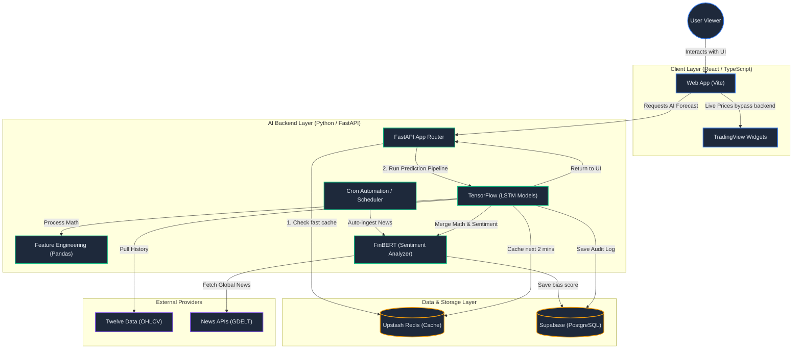
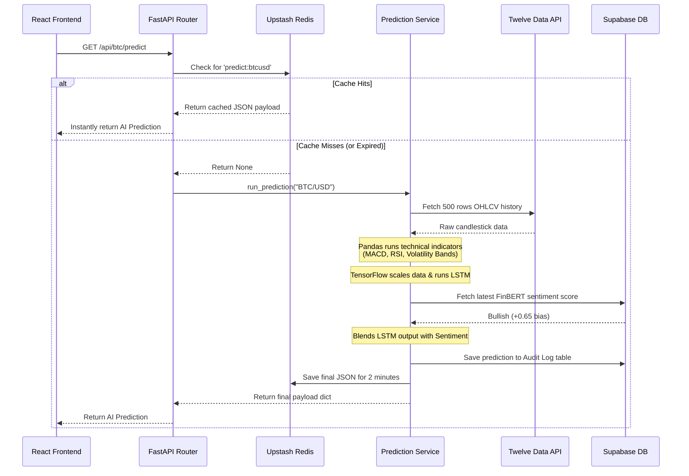

# System Architecture Overview

This document provides visual diagrams of the AI Stock Prediction System, detailing how the distinct modules communicate with each other.

## High-Level System Flow

This flowchart illustrates the primary components of the system and how user requests travel through the stack to generate machine learning predictions.

---

## Prediction Request Sequence

This sequence diagram takes a closer look at exactly what happens inside the system when a user triggers the `/api/{symbol}/predict` endpoint. It highlights the protective caching layer and how the system prevents API exhaustion.

